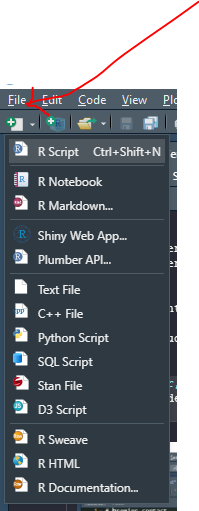
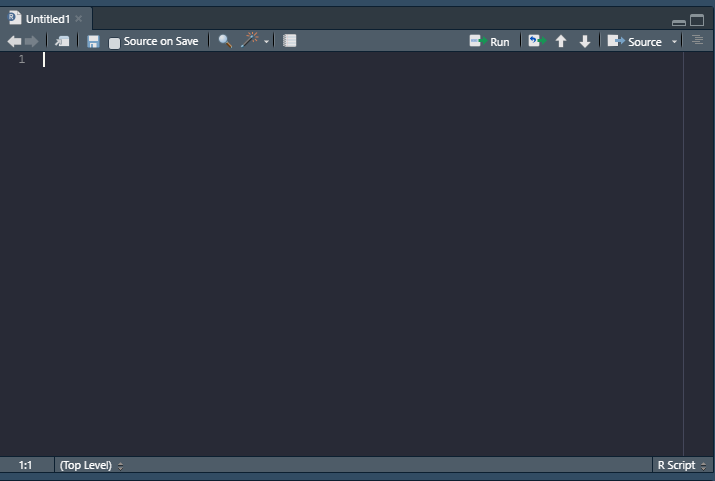
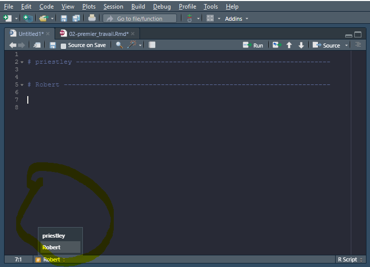
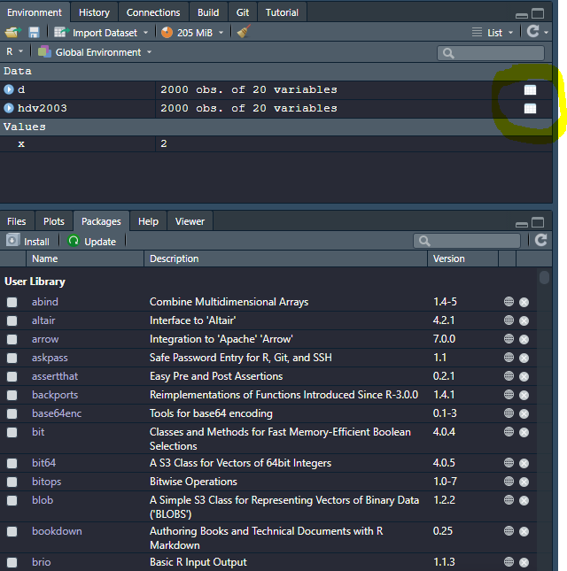
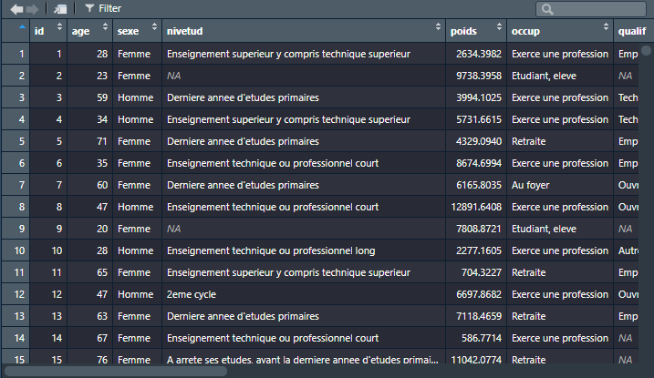

# PREMIER TRAVAIL AVEC LES DONNEES

## Regrouper les commandes dans des scripts

Jusqu'à maintenant nous avons utilisé uniquement la console pour communiquer avec R via l'invite de commandes. Le principal problème de ce mode d'interaction est qu'une fois qu'une commande est tapée, elle est pour ainsi dire « perdue », c'est-à-dire qu'on doit la saisir à nouveau si on veut l'exécuter une seconde fois. L'utilisation de la console est donc restreinte aux petites commandes « jetables », le plus souvent utilisées comme test.

La plupart du temps, les commandes seront stockées dans un fichier à part, que l'on pourra facilement ouvrir, éditer et exécuter en tout ou partie si besoin. On appelle en général ce type de fichier un script.

Pour comprendre comment cela fonctionne, dans RStudio cliquez sur l'icône en haut à gauche représentant un fichier avec un signe plus vert, puis choisissez R script.

```{r echo=FALSE,out.width="100%"}

```

Un nouvel onglet apparaît dans le quadrant supérieur gauche.

```{r echo=FALSE,out.width="100%"}

```

Nous pouvons désormais y saisir des commandes. Par exemple, tapez sur la première ligne la commande suivante : 2 + 2. Ensuite, cliquez sur l'icône Run (en haut à droite de l'onglet du script) ou bien pressez simulatément les touches CTRL et Entrée.

Les lignes suivantes ont dû faire leur apparition dans la console :

```{r echo=TRUE}
2+2
```

Voici donc comment soumettre rapidement à R les commandes saisies dans votre fichier. Vous pouvez désormais l'enregistrer, l'ouvrir plus tard, et en exécuter tout ou partie. À noter que vous avez plusieurs possibilités pour soumettre des commandes à R :

vous pouvez exécuter la ligne sur laquelle se trouve votre curseur en cliquant sur Run ou en pressant simulatément les touches CTRL et Entrée ; vous pouvez sélectionner plusieurs lignes contenant des commandes et les exécuter toutes en une seule fois exactement de la même manière ; vous pouvez exécuter d'un coup l'intégralité de votre fichier en cliquant sur l'icône Source. La plupart du travail sous R consistera donc à éditer un ou plusieurs fichiers de commandes et à envoyer régulièrement les commandes saisies à R en utilisant les raccourcis clavier ad hoc.

### Ajouter des commentaires

Un commentaire est une ligne ou une portion de ligne qui sera ignorée par R. Ceci signifie qu'on peut y écrire ce qu'on veut et qu'on va les utiliser pour ajouter tout un tas de commentaires à notre code permettant de décrire les différentes étapes du travail, les choses à se rappeler, les questions en suspens, etc.

Un commentaire sous R commence par un ou plusieurs symboles \# (qui s'obtient avec les touches Alt Gr et 3 sur les claviers de type PC). Tout ce qui suit ce symbole jusqu'à la fin de la ligne est considéré comme un commentaire. On peut créer une ligne entière de commentaire en la faisant débuter par ##. Par exemple :

```{r}
## Tableau croisé de la CSP par le nombre de livres lus.
## Attention au nombre de non réponses !
```

On peut aussi créer des commentaires pour une ligne en cours :

```{r}
x <- 2 # On met 2 dans x, parce qu'il le vaut bien
```

**NB**:*Dans tous les cas, il est très important de documenter ses fichiers R au fur et à mesure, faute de quoi on risque de ne plus y comprendre grand chose si on les reprend ne serait-ce que quelques semaines plus tard.*

Avec RStudio, vous pouvez également utiliser les commentaires pour créer des sections au sein de votre script et naviguer plus rapidement. Il suffit de faire suivre une ligne de commentaires d’au moins 4 signes moins (----). Par exemple, si vous saisissez ceci dans votre script :
```{r}
## Créer les objets ----

x <- 2
y <- 5

## Calculs ----

x + y
```

Vous verrez apparaître en bas à gauche de la fenêtre du script un symbole dièse orange. Si vous cliquez dessus, un menu de navigation s’affichera vous permettant de vous déplacez rapidement au sein de votre script.

```{r echo=FALSE,out.width="100%"}

```

**Note** : on remarquera au passage que le titre de l’onglet est affiché en rouge et suivi d’une astérisque (*), nous indiquant ainsi qu’il y a des modifications non enregistrées dans notre
fichier

## Tableaux de données

Dans cette partie nous allons utiliser un jeu de données inclus dans l’extension questionr. L’installation d’extension est décrite dans le chapitre Extensions.
Le jeu de données en question est un extrait de l’enquête Histoire de vie réalisée par l’INSEE en 2003. Il contient 2000 individus et 20 variables. Pour pouvoir utiliser ces données, il faut d’abord charger l’extension questionr (après l’avoir installée, bien entendu). Le chargement d’une extension en mémoire se fait à l’aide de la fonction library. Sous RStudio, vous pouvez également charger une extension en allant dans l’onglet Packages du quadrant inférieur droit qui liste l’ensemble des packages disponibles et en cliquant la case à cocher située à gauche du nom du package désiré.

```{r}
library(questionr)
```
Puis nous allons indiquer à R que nous souhaitons accéder au jeu de données hdv2003 à l’aide de la fonction data :
```{r}
  data(hdv2003)
```

Bien. Et maintenant, elles sont où mes données ? Et bien elles se trouvent dans un objet nommé hdv2003 désormais chargé en mémoire et accessible directement. D’ailleurs, cet objet est maintenant visible dans l’onglet Environment du quadrant supérieur droit.

Essayons de taper son nom à l’invite de commande :
```{r,eval=FALSE}
hdv2003
```
Le résultat (non reproduit ici) ne ressemble pas forcément à grand-chose… Il faut se rappeler que par défaut, lorsqu’on lui fournit seulement un nom d’objet, R essaye de l’afficher de la manière la meilleure (ou la moins pire) possible. La réponse à la commande hdv2003 n’est donc rien moins que l’affichage des données brutes contenues dans cet objet.

Ce qui signifie donc que l’intégralité de notre jeu de données est inclus dans l’objet nommé hdv2003 ! En effet, dans R, un objet peut très bien contenir un simple nombre, un vecteur ou bien le résultat d’une enquête tout entier. Dans ce cas, les objets sont appelés des data frames, ou tableaux de données. Ils peuvent être manipulés comme tout autre objet. Par exemple :

Résumons

Comme nous avons désormais décidé de saisir nos commandes dans un script et non plus directement dans la console, les premières lignes de notre fichier de travail sur les données de l’enquête Histoire de vie pourraient donc ressembler à ceci :
```{r}
## Chargement des extensions nécessaires ----
library(questionr)
## Jeu de données hdv2003 ----
data(hdv2003)
d <- hdv2003
```

### Inspection visuelle des données

La particularité de R par rapport à d’autres logiciels comme **Modalisa ou SPSS** est de ne pas proposer, par défaut, de vue des données sous forme de tableau. Ceci peut parfois être un peu déstabilisant dans les premiers temps d’utilisation, même si l’on perd vite l’habitude et qu’on finit par se rendre compte que « voir » les données n’est pas forcément un gage de productivité ou de rigueur dans le traitement.

Néanmoins, R propose une interface permettant de visualiser le contenu d’un tableau de données à l’aide de la fonction **View** :
```{r,eval=FALSE}
View(d)
```
Sous RStudio, on peut aussi afficher la visionneusee (viewer) en cliquant sur la petite icône en forme de tableau située à droite de la ligne d’un tableau de données dans l’onglet Environment du quadrant supérieur droit (cf. figure ci-après).

```{r echo=FALSE,out.width="100%"}

```
Dans tous les cas, RStudio lancera le viewer dans un onglet dédié dans le quadrant supérieur gauche. Le visualiseur de RStudio est plus avancé que celui-de base fournit par R. Il est possible de trier les données selon une variable en cliquant sur le nom de cette dernière. Il y a également un champs de recherche et un bouton Filter donnant accès à des options de filtrage avancées.

```{r echo=FALSE,out.width="100%"}

```
### Structure du tableau

Avant de travailler sur les données, nous allons essayer de comprendre comment elles sont structurées. Lors de l’import de données depuis un autre logiciel (que nous aborderons dans un autre chapitre), il s’agira souvent de vérifier que l’importation s’est bien déroulée.

Nous avons déjà vu qu’un tableau de données est organisé en lignes et en colonnes, les lignes correspondant aux observations et les colonnes aux variables. Les fonctions nrow, ncol et dim donnent respectivement le nombre de lignes, le nombre de colonnes et les dimensions de notre tableau. Nous pouvons donc d’ores et déjà vérifier que nnombre des lignes
```{r}
nrow(d)#Nombre de lignes:

```

```{r}
ncol(d)#nombre de colonnes :

```

```{r}
dim(d)# lignes x colonnes
```
La fonction **names** donne les noms des colonnes de notre tableau, c’est-à-dire les noms des variables :
```{r}
names(d)
```

### Accéder aux variables

d représente donc l’ensemble de notre tableau de données. Nous avons vu que si l’on saisit simplement d à l’invite de commandes, on obtient un affichage du tableau en question. Mais comment accéder aux variables, c’est à dire aux colonnes de notre tableau ?
La réponse est simple : on utilise le nom de l’objet, suivi de l’opérateur $, suivi du nom de la variable, comme ceci :

```{r,eval=FALSE}
d$sexe
```

Au regard du résultat (non reproduit ici), on constate alors que R a bien accédé au contenu de notre variable sexe du tableau d et a affiché son contenu, c’est-à-dire l’ensemble des valeurs prises par la variable.

Les fonctions head et tail permettent d’afficher seulement les premières (respectivement les dernières) valeurs prises par la variable. On peut leur passer en argument le nombre d’éléments à afficher :
```{r}
head(d$nivetud)# 6 premierès observations
```
```{r}
tail(d$age, 10)#10 dernières observations 
```
À noter que ces fonctions marchent aussi pour afficher les lignes du tableau d :
```{r}
head(d,2)
```

### La fonction **str**

La fonction str est plus complète que names. Elle liste les différentes variables, indique leur type et donne le cas échéant des informations supplémentaires ainsi qu’un échantillon des premières valeurs prises par cette variable :
```{r}
str(d)
```
La première ligne nous informe qu’il s’agit bien d’un tableau de données avec 2000 observations et 20 variables. Vient ensuite la liste des variables. La première se nomme id et est de type entier (int). La seconde se nomme age et est de type numérique. La troisième se nomme sexe, il s’agit d’un facteur (factor).

Un facteur est une variable pouvant prendre un nombre limité de modalités (levels). Ici notre variable a deux modalités possibles : « Homme » et « Femme ». Ce type de variable est décrit plus en détail dans le chapitre sur la manipulation de données.

**Important**

La fonction str est essentielle à connaître et peut s’appliquer à n’importe quel type d’objet. C’est un excellent moyen de connaître en détail la structure d’un objet. Cependant, les résultats peuvent être parfois trop détaillés et on lui priviligiera dans certains cas la fonction describe que l’on abordera dans les prochains chapitres, cependant moins générique puisque ne s’appliquant qu’à des tableaux de données et à des vecteurs, tandis que str peut s’appliquer à absolument tout objet, y compris des fonctions.
```{r}
describe(d)
```
### Quelques calculs simples

Maintenant que nous savons accéder aux variables, effectuons quelques calculs simples comme la moyenne, la médiane, le minimum et le maximum, à l’aide des fonctions mean, median, min et max.

```{r}
mean(d$age)
```

```{r}
median(d$age)
```

```{r}
min(d$age)
```

```{r}
max(d$age)
```

::: {#hello .greeting .message style="color: red;"}
Au sens strict, il ne s’agit pas d’un véritable âge moyen puisqu’il faudrait ajouter 0,5 à cette valeur calculée, un âge moyen se calculant à partir d’âges exacts et non à partir d’âges révolus.
On peut aussi très facilement obtenir un tri à plat à l’aide la fonction table :

:::: {.blackbox data-latex=""}
::: {.center data-latex=""}
**NOTICE!**
:::
Thank you for noticing this **new notice**! Your noticing it has
been noted, and _will be reported to the authorities_!
::::