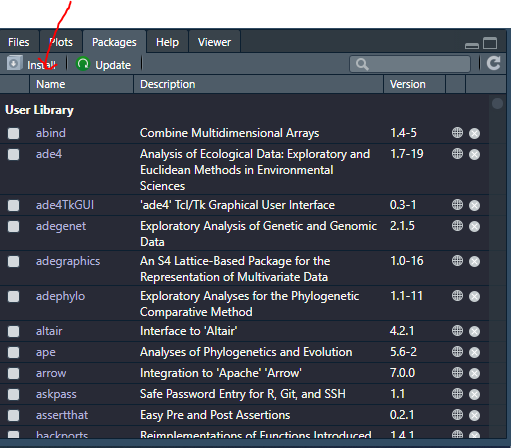
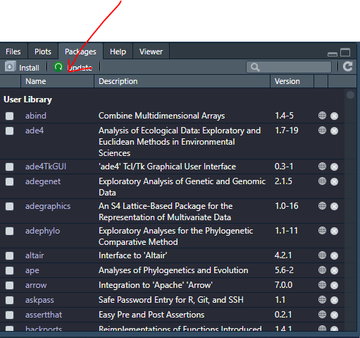

# Extensions (installation, mise à jour)

## Présentation

L’installation par défaut du logiciel R contient le cœur du programme ainsi qu’un ensemble de fonctions de base fournissant un grand nombre d’outils de traitement de données et d’analyse statistiques.

R étant un logiciel libre, il bénéficie d’une forte communauté d’utilisateurs qui peuvent librement contribuer au développement du logiciel en lui ajoutant des fonctionnalités supplémentaires. Ces contributions prennent la forme d’extensions (packages en anglais) pouvant être installées par l’utilisateur et fournissant alors diverses fonctionnalités supplémentaires.

Il existe un très grand nombre d’extensions (plus de 6500 à ce jour), qui sont diffusées par un réseau baptisé CRAN (Comprehensive R Archive Network).

La liste de toutes les extensions disponibles sur CRAN est disponible ici:[tous les packages](https://cran.r-project.org/web/packages/available_packages_by_date.html)

Pour faciliter un peu le repérage des extensions, il existe un ensemble de regroupements thématiques (économétrie, finance, génétique, données spatiales…) baptisés Task views :
[recherche des packages par thème](http://cran.r-project.org/web/views/)
On y trouve notamment une Task view dédiée aux sciences sociales, listant de nombreuses extensions potentiellement utiles pour les analyses statistiques dans ce champ disciplinaire :
[Packages pour les analyses statistiques avec les sciences sociales](http://cran.r-project.org/web/views/SocialSciences.html.)
On peut aussi citer le site Awesome R[https://github.com/qinwf/awesome-R](https://github.com/qinwf/awesome-R):qui fournit une liste d’extensions choisies et triées par thématique.

## Le tidyverse

Hadley Wickham est professeur associé à l’université de Rice et scientifique en chef à Rstudio. Il a développé de nombreux extensions pour R (plus d’une cinquantaine à ce jours) qui, pour la plupart, fonctionne de manière harmonisée entre elles. Par ailleurs, la plupart s’intègre parfaitement avec RStudio.

Pour certaines tâches, il peut exister plusieurs solutions / extensions différentes pour les réaliser. Dans la mesure où il n’est pas possible d’être exhaustif, nous avons fait le choix dans le cadre de cette initiation de choisir en priorité, lorsque cela est possible, les extensions du tidyverse, en particulier [haven](http://rdrr.io/pkg/haven), [readr](http://rdrr.io/pkg/readr) et [readxl](http://rdrr.io/pkg/readxl) pour l’import de données, [dplyr](http://rdrr.io/pkg/dplyr), [tidyr](http://rdrr.io/pkg/dplyr) ou reshape2 pour la manipulation de données, [ggplot2]() pour les graphiques, [lubridate](http://rdrr.io/pkg/lubridate) pour la gestion des dates, [forcats](http://rdrr.io/pkg/forcats) pour la manipulation des facteurs ou encore [stringr](http://rdrr.io/pkg/stringr) pour la manipulation de chaînes de caractères.

Il existe par ailleurs une extension homonyme [tidyverse](http://rdrr.io/pkg/tidyverse). L’installation (voir ci-dessous) de cette extension permets l’installation automatique de l’ensemble des autres extensions du tidyverse. Le chargement de cette extension avec la fonction library (voir ci-après) permets de charger en mémoire en une seule opération les principales extensions du tidyverse, à savoir [ggplot2]((http://rdrr.io/pkg/ggplot2)), [tibble](http://rdrr.io/pkg/tibble), [tidyr](http://rdrr.io/pkg/tidyr), [readr](http://rdrr.io/pkg/readr), [purrr](http://rdrr.io/pkg/purrr) et [dplyr](http://rdrr.io/pkg/dplyr).

Nous allons passer au peigne-fin certains packages du [tidyverse](http://rdrr.io/pkg/tidyverse).

## Installation depuis CRAN

L’installation d’une extension se fait par la fonction [install.packages](http://rdrr.io/pkg/utils/sym/install.packages), à qui on fournit le nom de l’extension. Par exemple, si on souhaite installer l’extension ade4 :

```{r,eval=FALSE,message=FALSE,warning=FALSE}
install.packages("classlnt", dep = TRUE)
```

L’option dep=TRUE indique à R de télécharger et d’installer également toutes les extensions dont l’extension choisie dépend pour son fonctionnement.

Sous RStudio, on pourra également cliquer sur Install dans l’onglet Packages du quadrant inférieur droit comme l'indique cette image :
```{r,out.width="70%",echo=FALSE}

```
Une fois l’extension installée, elle peut être appelée depuis la console ou un fichier script avec la fonction library ou la fonction require :
```{r}
library(ade4)
```
ou
```{r}
require(ade4)
```
À partir de là, on peut utiliser les fonctions de l’extension, consulter leur page d’aide en ligne, accéder aux jeux de données qu’elle contient, etc.

Pour mettre à jour l’ensemble des extensions installées, <dfndata-index=“mise à jour, extensions”> la fonction [update.packages ](http://rdrr.io/pkg/utils/sym/update.packages) suffit :

```{r,eval=FALSE}
update.packages("ade4")
```
ou 
Sous RStudio, on pourra alternativement cliquer sur Update dans l’onglet Packages du quadrant inférieur droit.
```{r,out.width="75%",echo=FALSE}

```
Si on souhaite désinstaller une extension précédemment installée, on peut utiliser la fonction [remove.packages](http://rdrr.io/pkg/utils/sym/remove.packages) :
```{r,eval=FALSE}
remove.packages("classlnt")
```

:::: {.redbox data-latex=""}
::: {.center data-latex=""}
**Important!**
:::
Il est important de bien comprendre la différence entre [install.packages](http://rdrr.io/pkg/utils/sym/install.packages) et [library](http://rdrr.io/pkg/utils/sym/install.packages). La première va chercher les extensions sur internet et les installe en local sur le disque dur de l’ordinateur. On n’a besoin d’effectuer cette opération qu’une seule fois. La seconde lit les informations de l’extension sur le disque dur et les met à disposition de R. On a besoin de l’exécuter à chaque début de session ou de script.
::::

## Installation depuis GitHub

Certains [packages](https://github.com/) sont développés sur GitHub. Dès lors, la version de développement sur GitHub peut contenir des fonctions qui ne sont pas encore disponibles dans la version stable disponible sur CRAN. Ils arrivent aussi parfois que certains packages ne soient disponibles que sur GitHub.
L’installation d’un package depuis GitHub est très facile grâce à la fonction [install_github](http://rdrr.io/pkg/devtools/sym/install_github) de l’extension [devtools](http://rdrr.io/pkg/devtools) (que l’on aura préalablement installée depuis CRAN ;-) )