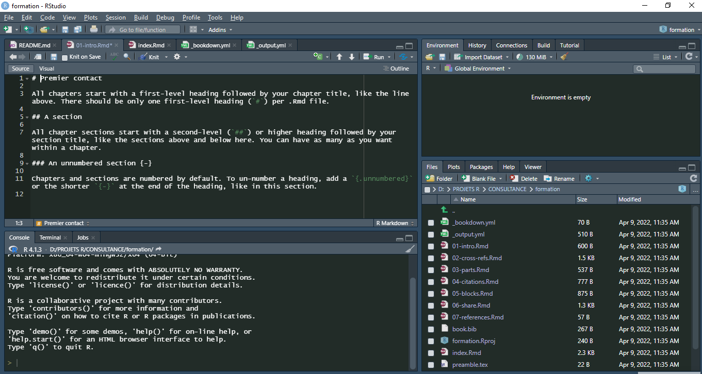
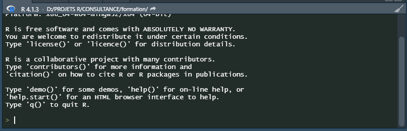
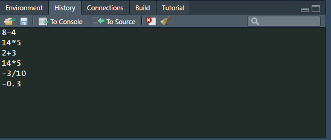
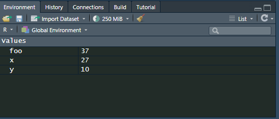
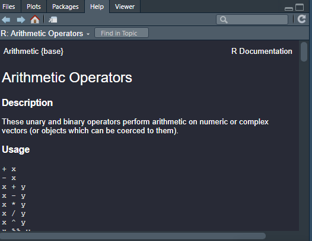

--- 
title: "Cours d'Analyse de Données avec R"
author: "Priestley"
date: "`r Sys.Date()`"
site: bookdown::bookdown_site
documentclass: book
bibliography: [book.bib, packages.bib]
# url: your book url like https://bookdown.org/yihui/bookdown
# cover-image: path to the social sharing image like images/cover.jpg
description: |
  Ce bouquin est une initiation à la programmation avec R surtout axée sur la partie analyse de données.
link-citations: yes
github-repo: priestmuhindo/formation-R
---

# Premier contact

Une fois RStudio lancé, vous devriez obtenir une fenêtre similaire à la figure ci-après.

```{r premier,message=FALSE,out.width="100%",echo=FALSE}

```
L’interface de RStudio est divisée en quatre quadrants :

- le quadrant supérieur gauche est dédié aux différents fichiers de travail (nous y reviendrons dans le chapitre Premier travail avec les données) ;
- le quadrant inférieur gauche correspond à ce que l’on appelle la console, c’est-à-dire à R proprement dit ;
- le quadrant supérieur droit permet de connaître
la liste des objets en mémoire ou environnement de travail (onglet Environment)
ainsi que l’historique des commandes saisies dans la console (onglet History) ;
- le quadrant inférieur droit affiche
la liste des fichiers du répertoire de travail (onglet Files),
les graphiques réalisés (onglet Plots),
la liste des extensions disponibles (onglet Packages),
l’aide en ligne (onglet Help)
et un Viewer utilisé pour visualiser certains types de graphiques au format web.
Inutile de tout retenir pour le moment. Nous aborderons chaque outil en temps utile. Pour l’heure, concentrons-nous sur la console, c’est-à-dire le quadrant inférieur gauche


## L’invite de commandes

Au démarrage, la console contient un petit texte de bienvenue ressemblant à peu près à ce qui suit :
```{r console,message=FALSE,out.width="100%",echo=FALSE}

```
suivi d’une ligne commençant par le caractère > et sur laquelle devrait se trouver votre curseur. Cette ligne est appelée l’invite de commande (ou prompt en anglais). Elle signifie que R est disponible et en attente de votre prochaine commande.

Nous allons tout de suite lui fournir une première commande. Tapez 2 + 3 dans la console et validez avec la touche Entrée.
```{r}
2+3
```
En premier lieu, vous pouvez noter la convention typographique utilisée dans ce documents. Les commandes saisies dans la console sont indiquées sur un fond gris et précédé de R>. Le résultat renvoyé par R est quant à lui affiché juste en-dessous sur fond blanc.

Bien, nous savons désormais que R sait faire les additions à un chiffre. Nous pouvons désormais continuer avec d’autres opérations arithmétiques de base :
```{r}
8-4
```
```{r}
14*5
```

```{r}
-3/10
```

```{r}
-0.3
```
On remarquera que R est anglo-saxon. Les nombres sont donc saisies « à l’anglaise », c’est-à-dire en utilisant le point (.) comme séparateur pour les décimales.
Une petite astuce très utile lorsque vous tapez des commandes directement dans la console : en utilisant les flèches Haut et Bas du clavier, vous pouvez naviguer dans l’historique des commandes tapées précédemment. Vous pouvez alors facilement réexécuter ou modifier une commande particulière.

Sous RStudio, l’onglet History du quadrant haut-droite vous permet de consulter l’historique des commandes que vous avez transmises à R.
```{r,out.width="100%",echo=FALSE,message=FALSE,warning=FALSE}

```

## Des objets
### Objets simples
Faire des opérations arithmétiques, c’est bien, mais sans doute pas totalement suffisant. Notamment, on aimerait pouvoir réutiliser le résultat d’une opération sans avoir à le resaisir ou à le copier/coller.

Comme tout langage de programmation, R permet de faire cela en utilisant des objets. Prenons tout de suite un exemple :
```{r}
x <- 2
```

Que signifie cette commande ? L’opérateur <- est appelé opérateur d’assignation. Il prend une valeur quelconque à droite et la place dans l’objet indiqué à gauche. La commande pourrait donc se lire mettre la valeur 2 dans l’objet nommé x.
NB:Il existe trois opérateurs d’assignation sous R. Ainsi les trois écritures suivantes sont équivalentes :
```{r}
x <- 2
x = 2
2 -> x
```

Cependant, pour une meilleure lecture du code, il est conseillé de n’utiliser que <-. Ainsi, l’objet créé est systématiquement affiché à gauche. De plus, le symbole = sert également pour écrire des conditions ou à l’intérieur de fonctions. Il est donc préférable de ne pas l’utiliser pour assigner une valeur (afin d’éviter les confusions).
On va ensuite pouvoir réutiliser cet objet dans d’autres calculs ou simplement afficher son contenu :
```{r}
x+3
```

On peut utiliser autant d’objets qu’on veut. Ceux-ci peuvent contenir des nombres, des chaînes de caractères (indiquées par des guillemets droits doubles " ou simples ') et bien d’autres choses encore :

```{r}
x <- 27
y <- 10
foo <- x + y
foo
```
```{r}
x <- "Hello"
foo <- x
foo
```

Les noms d’objets peuvent contenir des lettres, des chiffres, les symboles . et _. Ils doivent impérativement commencer par une lettre (jamais par un chiffre). R fait la différence entre les majuscules et les minuscules, ce qui signifie que x et X sont deux objets différents. On évitera également d’utiliser des caractères accentués dans les noms d’objets. Comme les espaces ne sont pas autorisés on pourra les remplacer par un point ou un tiret bas.

Enfin, signalons que certains noms courts sont réservés par R pour son usage interne et doivent être évités. On citera notamment c, q, t, C, D, F, I, T, max, min…

Dans RStudio, l’onglet Environment dans le quadrant supérieur droit indique la liste des objets que vous avez précédemment créés, leur type et la taille qu’ils occupent en mémoire.

```{r,echo=FALSE,out.width="100%",message=FALSE,warning=FALSE}

```

### Vecteurs
Imaginons maintenant que nous avons interrogé dix personnes au hasard dans la rue et que nous avons relevé pour chacune d’elle sa taille en centimètres. Nous avons donc une série de dix nombres que nous souhaiterions pouvoir réunir de manière à pouvoir travailler sur l’ensemble de nos mesures.

Un ensemble de données de même nature constituent pour R un vecteur (en anglais vector) et se construit à l’aide d’une fonction nommée c. On l’utilise en lui donnant la liste de nos données, entre parenthèses, séparées par des virgules :
```{r}
tailles <- c(167, 192, 173, 174, 172, 167, 171, 185, 163, 170)
```
Ce faisant, nous avons créé un objet nommé tailles et comprenant l’ensemble de nos données, que nous pouvons afficher en saisissant simplement son nom :
```{r}
c(144, 168, 179, 175, 182, 188, 167, 152, 163, 145, 176, 155, 156, 164, 167, 155, 157, 185, 155, 169, 124, 178, 182, 195, 151, 185, 159, 156, 184, 172)
```
On a bien notre suite de trente tailles, mais on peut remarquer la présence de nombres entre crochets au début de chaque ligne ([1], [15] et [29]). En fait ces nombres entre crochets indiquent la position du premier élément de la ligne dans notre vecteur. Ainsi, le 167 en début de deuxième ligne est le 15e élément du vecteur, tandis que le 184 de la troisième ligne est à la 29e position.

On en déduira d’ailleurs que lorsque l’on fait :
```{r}
2
```
R considère en fait le nombre 2 comme un vecteur à un seul élément.

On peut appliquer des opérations arithmétiques simples directement sur des vecteurs :
```{r}
tailles <- c(167, 192, 173, 174, 172, 167, 171, 185, 163, 170)
tailles + 20
```

```{r}
tailles / 100
```

```{r}
tailles^2
```

On peut aussi combiner des vecteurs entre eux. L’exemple suivant calcule l’indice de masse corporelle à partir de la taille et du poids :

```{r}
tailles <- c(167, 192, 173, 174, 172, 167, 171, 185, 163, 170)
poids <- c(86, 74, 83, 50, 78, 66, 66, 51, 50, 55)
tailles.m <- tailles / 100
imc <- poids / (tailles.m^2)
imc
```
Quand on fait des opérations sur les vecteurs, il faut veiller à soit utiliser un vecteur et un chiffre (dans des opérations du type v * 2 ou v + 10), soit à utiliser des vecteurs de même longueur (dans des opérations du type u + v).

Si on utilise des vecteurs de longueur différentes, on peut avoir quelques surprises. Quand R effectue une opération avec deux vecteurs de longueurs différentes, il recopie le vecteur le plus court de manière à lui donner la même taille que le plus long, ce qui s’appelle la règle de recyclage (recycling rule). Ainsi, c(1,2) + c(4,5,6,7,8) vaudra l’équivalent de c(1,2,1,2,1) + c(4,5,6,7,8).
On a vu jusque-là des vecteurs composés de nombres, mais on peut tout à fait créer des vecteurs composés de chaînes de caractères, représentant par exemple les réponses à une question ouverte ou fermée :
```{r}
reponse <- c("Bac+2", "Bac", "CAP", "Bac", "Bac", "CAP", "BEP")
reponse
```

Enfin, notons que l’on peut accéder à un élément particulier du vecteur en faisant suivre le nom du vecteur de crochets contenant le numéro de l’élément désiré. Par exemple :
```{r}
reponse <- c("Bac+2", "Bac", "CAP", "Bac", "Bac", "CAP", "BEP")
reponse[2]
```
Cette opération s’appelle l’indexation d’un vecteur. Il s’agit ici de sa forme la plus simple, mais il en existe d’autres beaucoup plus complexes. L’indexation des vecteurs et des tableaux dans R est l’un des éléments particulièrement souples et puissants du langage (mais aussi l’un des plus délicats à comprendre et à maîtriser). Nous en reparlerons dans le chapitre Vecteurs, indexation et assignation.

NB:Sous RStudio, vous avez du remarquer que ce dernier effectue une coloration syntaxique. Lorsque vous tapez une commande, les valeurs numériques sont affichées dans une certaine couleur, les valeurs textuelles dans une autre et les noms des fonctions dans une troisième. De plus, si vous tapez une parenthèse ouvrante, RStudio va créer automatiquement après le curseur la parenthèse fermante correspondante (de même avec les guillements ou les crochets). Si vous placez le curseur juste après une parenthèse fermante, la parenthèse ouvrante correspondante sera surlignée, ce qui sera bien pratique lors de la rédaction de commandes complexes.

## Des fonctions
Nous savons désormais faire des opérations simples sur des nombres et des vecteurs, stocker ces données et résultats dans des objets pour les réutiliser par la suite.

Pour aller un peu plus loin nous allons aborder, après les objets, l’autre concept de base de R, à savoir les fonctions. Une fonction se caractérise de la manière suivante :

- elle a un nom ;
- elle accepte des arguments (qui peuvent avoir un nom ou pas) ;
- elle retourne un résultat et peut effectuer une action comme dessiner un graphique ou lire un fichier.
En fait rien de bien nouveau puisque nous avons déjà utilisé plusieurs fonctions jusqu’ici, dont la plus visible est la fonction c. Dans la ligne suivante :
```{r}
reponse <- c("Bac+2", "Bac", "CAP", "Bac", "Bac", "CAP", "BEP")
```

on fait appel à la fonction nommée c, on lui passe en arguments (entre parenthèses et séparées par des virgules) une série de chaînes de caractères et elle retourne comme résultat un vecteur de chaînes de caractères, que nous stockons dans l’objet reponse.

Prenons tout de suite d’autres exemples de fonctions courantes :
```{r}
tailles <- c(167, 192, 173, 174, 172, 167, 171, 185, 163, 170)
length(tailles)
```

```{r}
mean(tailles)
```

```{r}
var(tailles)
```

Ici, la fonction length nous renvoie le nombre d’éléments du vecteur, la fonction mean nous donne la moyenne des éléments du vecteur et fonction var sa variance.
### Arguments
Les arguments de la fonction lui sont indiqués entre parenthèses, juste après son nom. En général les premiers arguments passés à la fonction sont des données servant au calcul et les suivants des paramètres influant sur ce calcul. Ceux-ci sont en général transmis sous la forme d’argument nommés.

Reprenons l’exemple des tailles précédent :
```{r}
tailles <- c(167, 192, 173, 174, 172, 167, 171, 185, 163, 170)
```
Imaginons que le deuxième enquêté n’ait pas voulu nous répondre. Nous avons alors dans notre vecteur une valeur manquante. Celle-ci est symbolisée dans R par le code NA :

```{r}
tailles <- c(167, NA, 173, 174, 172, 167, 171, 185, 163, 170)
```
Recalculons notre taille moyenne :
```{r}
mean(tailles)
```

## Exercice

1. Créer un vecteur nommé a qui reprend la liste des individus suivants:lannister,targaryen,baratheon,starck et greyjoy
-  Quelle est la longueur du vecteur ? 
- Essayez de faire a[1:3]. Qu’obtenez-vous ?    
- Essayez de faire a[-1]. Qu’obtenez-vous ?
2. Considérons le vecteur suivant : x =[1 2 3 4 5],b=[3,3,4]
-  Créer ces vecteurs dans R et le stocker dans un objet que l’on appellera x et b ;
- Additionner  les vecteurs x et b(en cas d'erreur ,corriger cette erreur)
- Soustraire les vecteurs x et b
- multiplier les deux vecteurs
- ajouter de manière separée aux deux vecteurs ,le nombre 10,
- calculer la longuer de chaque vecteur;
- calculer la somme des éléments de chaque vecteur
- calculer la moyenne des éléments de chaque vecteur
- calculer la variance es éléments de chaque vecteur
- calculer l'ecart-type des éléments de chaque vecteur
- calculer le coefficients de variation de chaque vecteur;
- calculer la médiane de chaque vecteur
- dans les deux vecteurs ,remplacer le deuxième élément par une valeur manquante,puis refaites tous les calculs et notez ce que vous observez

##  Des arguments

Les arguments de la fonction lui sont indiqués entre parenthèses, juste après son nom. En général les premiers arguments passés à la fonction sont des données servant au calcul et les suivants des paramètres influant sur ce calcul. Ceux-ci sont en général transmis sous la forme d’argument nommés.

Reprenons l’exemple des tailles précédent :
```{r}
tailles <- c(167, 192, 173, 174, 172, 167, 171, 185, 163, 170)
```

Imaginons que le deuxième enquêté n’ait pas voulu nous répondre. Nous avons alors dans notre vecteur une valeur manquante. Celle-ci est symbolisée dans R par le code NA :

```{r}
tailles <- c(167, NA, 173, 174, 172, 167, 171, 185, 163, 170)
```

```{r}
mean(tailles)
```
Et oui, par défaut, R renvoie NA pour un grand nombre de calculs (dont la moyenne) lorsque les données comportent une valeur manquante. On peut cependant modifier ce comportement en fournissant un paramètre supplémentaire à la fonction mean, nommé na.rm :

```{r}
mean(tailles, na.rm = TRUE)
```
Positionner le paramètre na.rm à TRUE (vrai) indique à la fonction mean de ne pas tenir compte des valeurs manquantes dans le calcul.

Lorsqu’on passe un argument à une fonction de cette manière, c’est-à-dire sous la forme nom=valeur, on parle d’argument nommé.

## Attention
NA signifie not available. Cette valeur particulière peut être utilisée pour indiquer une valeur manquante pour tout type de liste (nombres, textes, valeurs logique, etc.).

## Aide sur une fonction
Il est très fréquent de ne plus se rappeler quels sont les paramètres d’une fonction ou le type de résultat qu’elle retourne. Dans ce cas on peut très facilement accéder à l’aide décrivant une fonction particulière avec ? ou help. Ainsi, pour obtenir de l’aide sur la fonction mean, on saisira l’une des deux entrées équivalentes suivantes :
### Note

L’utilisation du raccourci ? ne fonctionne pas pour certains opérateurs comme *. Dans ce cas on pourra utiliser ?'*' ou bien simplement help("*").
Sous RStudio, le fichier d’aide associé apparaitra dans le quadrant inférieur droit sous l’onglet Help.

```{r,message=FALSE,warning=FALSE,echo=FALSE,out.width="100%"}

```

Cette page décrit (en anglais) la fonction, ses arguments, son résultat, le tout accompagné de diverses notes, références et exemples. Ces pages d’aide contiennent à peu près tout ce que vous pourrez chercher à savoir, mais elles ne sont pas toujours d’une lecture aisée.

Un autre cas très courant dans R est de ne pas se souvenir ou de ne pas connaître le nom de la fonction effectuant une tâche donnée. Dans ce cas on se reportera aux différentes manières de trouver de l’aide décrites dans le chapitre Où trouver de l’aide ?.

### Autocomplétion

RStudio fournit un outil bien pratique appelé autocomplétion. Saisissez les premières lettres d’une fonction, par exemple me puis appuyez sur la touche Tabulation. RStudio affichera la liste des fonctions dont le nom commence par me ainsi qu’un court descriptif de chacune. Un appui sur la touche Entrée provoquera la saisie du nom complet de la fonction choisie.

